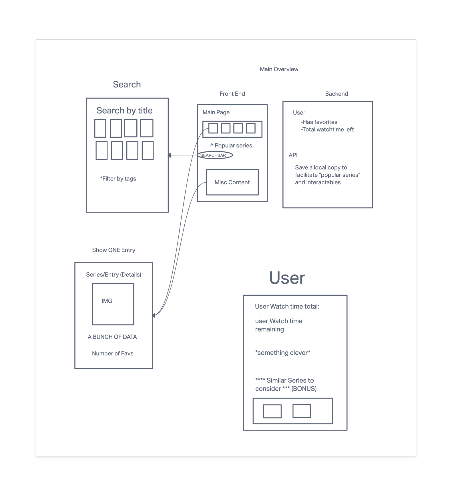
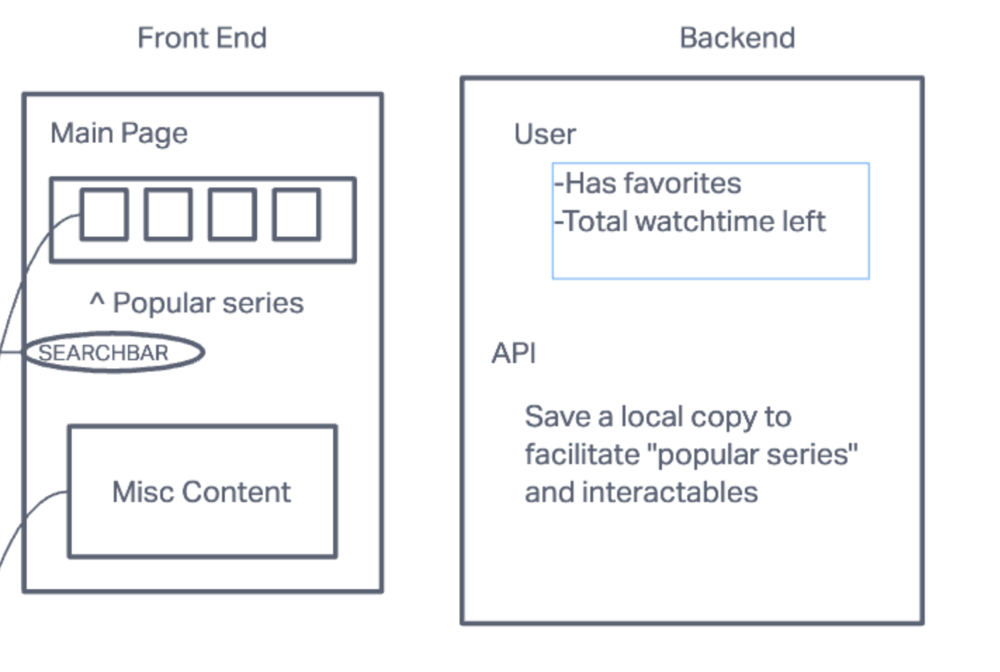
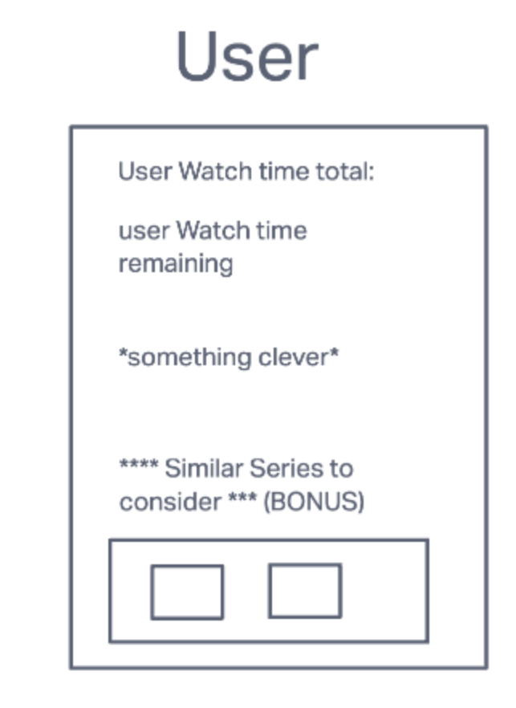
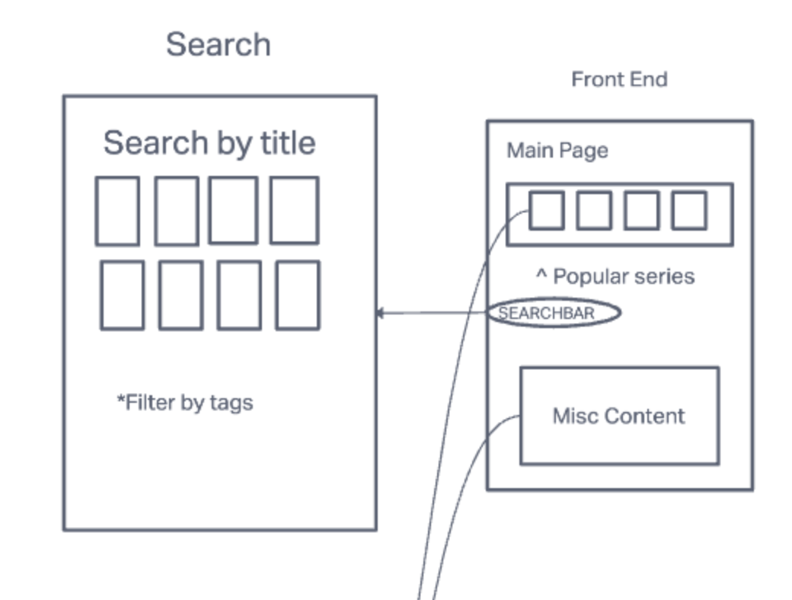
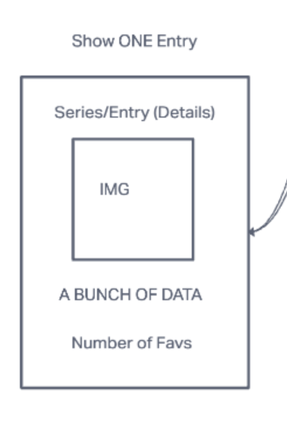

# BucketList

## Introduction
- A bucketlist app. Add to your backlog of shows/movies to see how much you have left to watch/do
## User Stories
    
- As a user I want to be able to:
    - See my own bucketlist with total time left
    - See how popular my shows are
    - See how many of these shows are completed amongst other users

## Technologies Used
    Movie Api (As a base)

## Screenshots

## Getting Started

[Trello](https://trello.com/b/xBeIjV7q/project3bl)
Start [herePLACEHOLDER](http://google.com)

## Future Enhancements
- Add more catalog depth
- Add in misc activities (skydiving, hiking, etc)
- Generate recomendations based on popularity of other shows, friends, etc